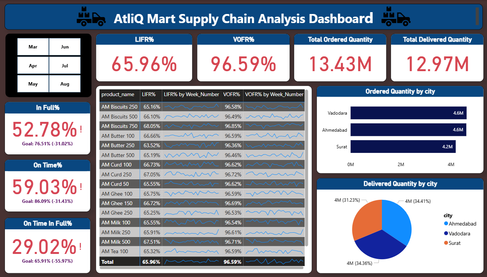
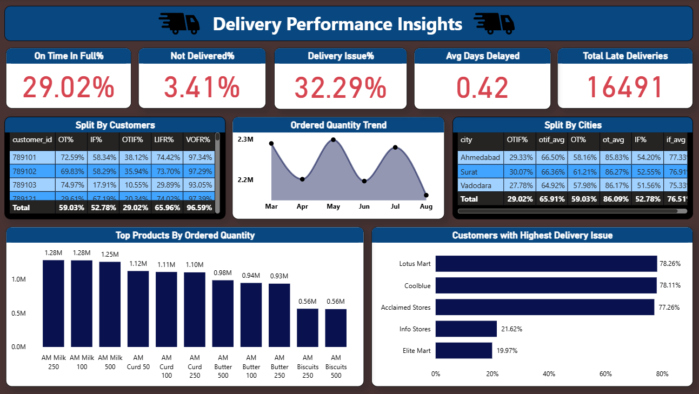

# **Supply Chain Delivery Performance Analysis**

## **Supply Chain Management**

Supply chain management plays a critical role in ensuring the smooth flow of goods from suppliers to customers. Delivery performance is a key component of supply chain efficiency, as it directly impacts customer satisfaction and business success. Monitoring metrics such as On-Time Delivery, In-Full Delivery, and OTIF helps organizations identify performance gaps and improve overall service levels.

## **Problem Statement**

AtliQ Mart is a fast-growing FMCG manufacturer operating in Gujarat, with presence in cities such as Vadodara, Surat, and Ahmedabad, and plans to expand to other regions.Recently, the company has been losing key customers due to service-related issues, primarily caused by delayed and incomplete deliveries.
To address this problem, the supply chain team aims to monitor and improve delivery performance using key metrics such as On-Time Delivery (OT%), In-Full Delivery (IF%), and On-Time In-Full (OTIF%) against defined target service levels.

## Tools Used
- **Excel** – Data cleaning 
- **Power BI** – Dashboard creation and visualization  
- **DAX** – Calculated measures and KPIs
  
## AtliQ Mart Supply Chain Dataset

This dataset was taken from Kaggle and is used for analyzing delivery performance in a supply chain system. The data helps measure key metrics like On-Time Delivery, In-Full Delivery, and OTIF performance across customers, products, and orders.

### Columns:

- **order_id** → Unique identifier for each order  
- **customer_id** → Unique ID of the customer placing the order  
- **order_placement_date** → Date when the order was placed  
- **agreed_delivery_date** → Promised delivery date given to the customer  
- **actual_delivery_date** → Actual delivery date of the order  
- **order_qty** → Quantity ordered by the customer  
- **delivery_qty** → Quantity actually delivered  
- **on_time** → Indicates whether delivery was on or before agreed date (1 = Yes, 0 = No)  
- **in_full** → Indicates whether full quantity was delivered (1 = Yes, 0 = No)  
- **otif** → On-Time In-Full indicator (1 = Yes, 0 = No)  
- **product_id** → Unique identifier for each product  
- **In_Full** → Full delivery indicator (1 = Yes, 0 = No)  
- **On_Time** → On-time delivery indicator (1 = Yes, 0 = No)  
- **On_Time_In_Full** → Combined on-time and full delivery indicator (1 = Yes, 0 = No)  
- **ontime_target%** → Target percentage for on-time delivery  
- **infull_target%** → Target percentage for full delivery  
- **otif_target%** → Target percentage for on-time in-full delivery  
- **product_name** → Name of the product  
- **category** → Product category  
- **customer_name** → Name of the customer  
- **city** → Customer city  
- **date** → Calendar date  
- **mmm_yy** → Month-Year format  
- **week_no** → Week number of the year

## Key Performance Indicators (KPIs)
Delivery Performance Metrics
- On-Time Delivery % (OT%)
- In-Full Delivery % (IF%)
- On-Time In-Full % (OTIF)

Service Level Metrics
- Line Fill Rate (LIFR)
- Volume Fill Rate (VOFR)

Issue & Delay Metrics
- Delivery Issue %
- Total Late Deliveries
- Not Delivered %
- Average Days Delayed

## Dashboard Screenshots

### Supply Chain Overview

### Delivery Insights

**Power BI Dashboard:** 
[supply-chain-dashboard.pbix](dashboard/supply-chain-dashboard.pbix)

## Key Insights

- OTIF performance is below target, indicating inefficiencies in delivery operations.
- Late deliveries contribute more to delivery issues compared to not delivered orders.
- Certain customers show consistently higher delivery issues.
- Overall performance is close to target but requires improvement in delivery timeliness.

## **Conclusion**
Improving delivery timeliness and reducing delays can significantly enhance overall supply chain performance. This can be achieved by optimizing delivery routes, improving coordination between warehouses and logistics teams, and closely monitoring high-delay customers and regions. Additionally, implementing better demand forecasting and inventory planning can help reduce partial and delayed deliveries.

   

   
